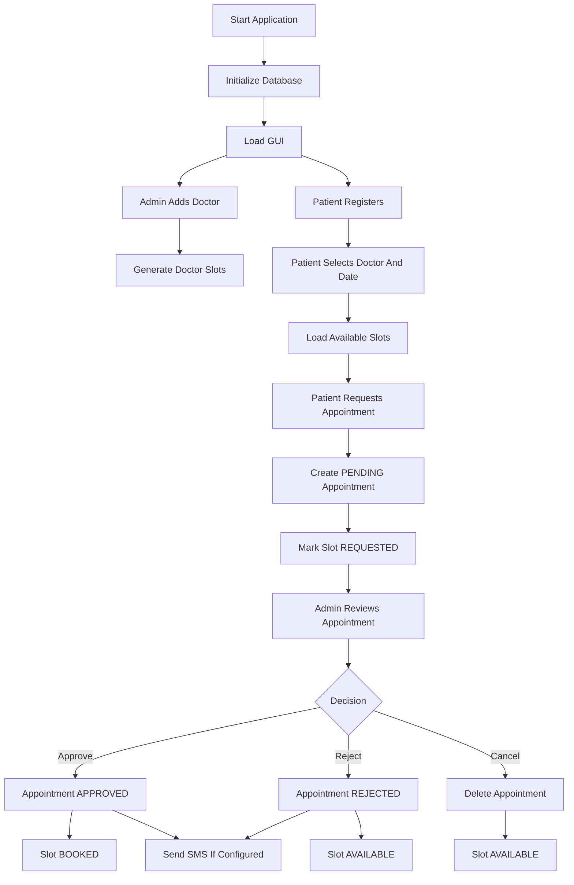
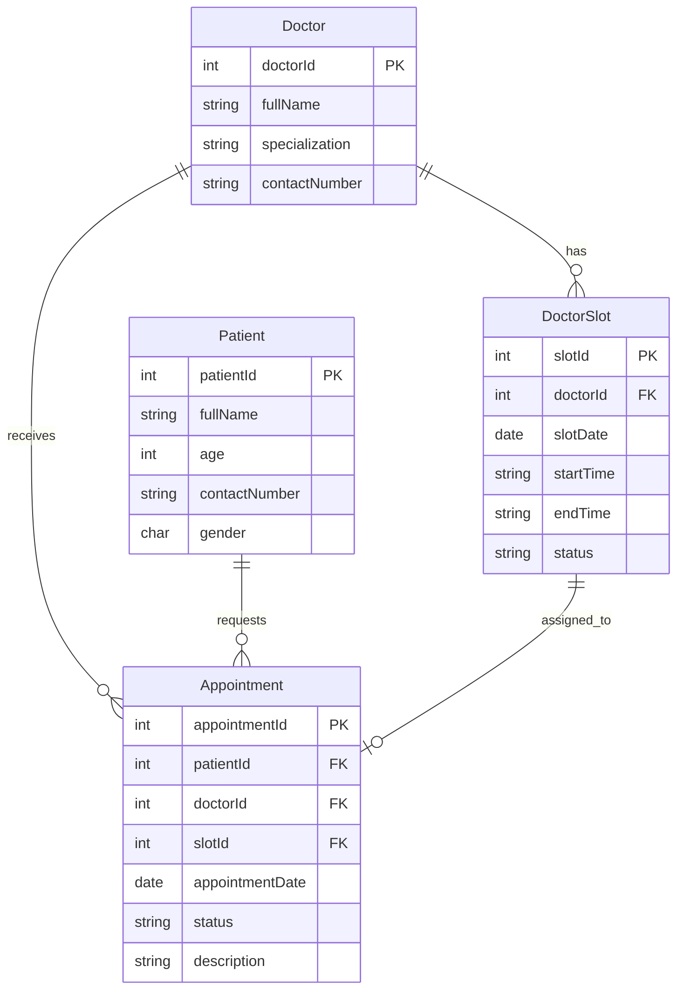
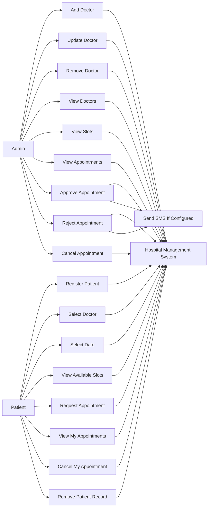
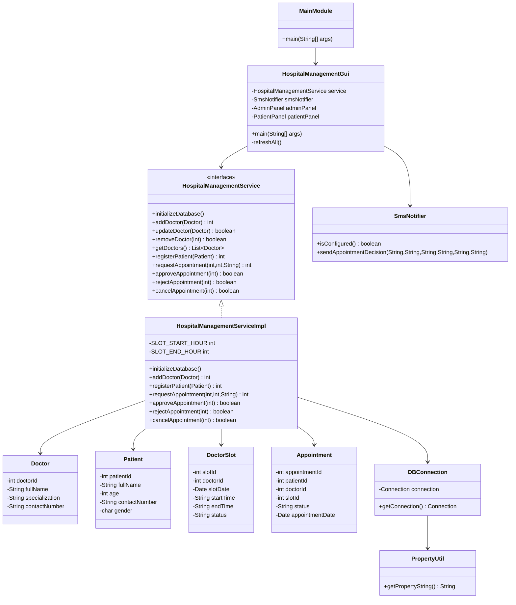

# Hospital Management System

Hospital Management System is a Java Swing desktop application for managing doctors, patients, appointment slots, and appointment approvals. It uses MySQL for persistent storage and JDBC for database operations. The application has two main GUI areas:

- Administration: manage doctors, view generated slots, and approve, reject, or cancel appointment requests.
- Patient: register patients, select a doctor and available slot, request appointments, view patient appointments, cancel appointments, and remove patients.

## Table of Contents

- [Project Overview](#project-overview)
- [Technology Used](#technology-used)
- [Features](#features)
- [How The Software Works](#how-the-software-works)
- [Project Structure](#project-structure)
- [All Classes](#all-classes)
- [Database Design](#database-design)
- [Use Case Diagram](#use-case-diagram)
- [Class Diagram](#class-diagram)
- [Main Scenarios](#main-scenarios)
- [OOP Principles Used](#oop-principles-used)
- [Design Principles Used](#design-principles-used)
- [Setup And Run](#setup-and-run)
- [Configuration](#configuration)

## Project Overview

The system manages the hospital appointment lifecycle from doctor setup to patient booking and administrator approval. When the application starts, it initializes the required MySQL tables if they do not already exist. For each doctor, the service creates default 10-minute appointment slots from 09:00 to 20:00 for the selected date. Patients can request only available slots. Once a request is made, the slot moves to `REQUESTED`. Administration can approve the appointment, reject it, or cancel it.

Appointment and slot status are tracked separately:

- Appointment status: `PENDING`, `APPROVED`, `REJECTED`, `CANCELLED`
- Slot status: `AVAILABLE`, `REQUESTED`, `BOOKED`

## Technology Used

| Area | Technology |
| --- | --- |
| Programming language | Java |
| Java version | JavaSE-17 project configuration |
| GUI framework | Java Swing |
| Database | MySQL |
| Database connectivity | JDBC |
| MySQL driver | `mysql-connector-j-9.6.0.jar` |
| Build/project style | Eclipse Java project |
| Configuration | `util/db.properties` |
| SMS notification | Twilio REST API through Java `HttpClient` |

## Features

- Doctor management
  - Add doctor
  - Update doctor
  - Remove doctor
  - View all doctors
  - Auto-generate daily appointment slots for doctors

- Patient management
  - Register patient
  - View registered patients
  - Remove patient
  - View appointments for a selected patient

- Appointment management
  - Select doctor and appointment date
  - Load available slots for that doctor/date
  - Request appointment
  - Approve appointment
  - Reject appointment
  - Cancel appointment
  - View appointment status

- Database support
  - Creates required tables automatically
  - Adds missing columns for older database versions
  - Backfills doctor, patient, and appointment names when possible
  - Uses foreign keys for doctor, patient, slot, and appointment relationships

- Notification support
  - Sends SMS for approved/rejected appointments when Twilio environment variables are configured
  - Skips SMS safely when Twilio configuration is missing

## How The Software Works

1. The user starts the application through `mainmod.MainModule`.
2. `MainModule` opens `gui.HospitalManagementGui`.
3. `HospitalManagementGui` creates `HospitalManagementServiceImpl`.
4. The service initializes the database using `DBConnection` and `PropertyUtil`.
5. The GUI loads the Administration and Patient tabs.
6. Admin adds doctors.
7. The service automatically creates 10-minute doctor slots from 09:00 to 20:00.
8. Patient registers with name, age, phone number, and gender.
9. Patient selects a doctor and date.
10. The service loads available slots for that doctor/date.
11. Patient requests an appointment.
12. The service creates a `PENDING` appointment and changes the selected slot to `REQUESTED`.
13. Admin approves, rejects, or cancels the appointment.
14. Approval changes appointment status to `APPROVED` and slot status to `BOOKED`.
15. Rejection changes appointment status to `REJECTED` and slot status back to `AVAILABLE`.
16. Cancellation deletes the appointment and makes the slot `AVAILABLE` again.
17. If SMS settings are available, `SmsNotifier` sends the patient an approval/rejection message.

### Appointment Request Flow



## Project Structure

```text
Hospital-Management-System/
|-- mysql-connector-j-9.6.0.jar
|-- README.md
|-- src/
|   |-- dao/
|   |-- entity/
|   |-- gui/
|   |-- mainmod/
|   |-- myexceptions/
|   |-- notification/
|   |-- service/
|   |-- util/
|-- bin/
```

## All Classes

### `mainmod.MainModule`

Application entry point.

- `main(String[] args)`: starts the Swing GUI.
- Supports `--check` argument to initialize the database and print a startup check result.

### `gui.HospitalManagementGui`

Main Swing window. It creates the service layer, initializes the database, builds the Administration and Patient tabs, refreshes data, and handles user-facing error messages.

Main responsibilities:

- Start the GUI using `SwingUtilities.invokeLater`.
- Build tabs for Administration and Patient workflows.
- Call service methods when users click buttons.
- Refresh doctors, patients, slots, and appointments.
- Show validation/database errors using dialogs.

Nested GUI helper classes:

| Class | Purpose |
| --- | --- |
| `AdminPanel` | Doctor management and appointment decision screen. |
| `PatientPanel` | Patient registration and appointment request screen. |
| `ReadOnlyTableModel` | Table model that prevents direct editing. |
| `CheckBoxTableModel` | Table model with editable checkbox selection in the first column. |
| `PlaceholderTextField` | Text field that paints placeholder text when empty. |
| `StatusCellRenderer` | Colors appointment status values in tables. |
| `DoctorItem` | Combo box wrapper for displaying doctor name and specialization. |
| `SlotItem` | Combo box wrapper for displaying slot details. |

### `service.HospitalManagementService`

Service interface for the main application use cases.

Methods:

- `initializeDatabase()`
- `addDoctor(Doctor doctor)`
- `updateDoctor(Doctor doctor)`
- `removeDoctor(int doctorId)`
- `getDoctors()`
- `addSlot(DoctorSlot slot)`
- `removeSlot(int slotId)`
- `getSlots()`
- `getAvailableSlots()`
- `getAvailableSlotsForDoctorOnDate(int doctorId, Date slotDate)`
- `registerPatient(Patient patient)`
- `removePatient(int patientId)`
- `getPatients()`
- `requestAppointment(int patientId, int slotId, String description)`
- `approveAppointment(int appointmentId)`
- `rejectAppointment(int appointmentId)`
- `cancelAppointment(int appointmentId)`
- `getAppointments()`
- `getAppointmentsForPatient(int patientId)`

### `service.HospitalManagementServiceImpl`

Main business logic and database implementation used by the GUI.

Main responsibilities:

- Create and migrate database tables.
- Validate doctor, patient, date, and appointment inputs.
- Manage doctor records.
- Manage patient records.
- Generate default doctor slots.
- Request appointments transactionally.
- Approve/reject/cancel appointments transactionally.
- Keep appointment and slot statuses consistent.
- Map database result sets to entity objects.

Important constants:

- `SLOT_START_HOUR = 9`
- `SLOT_END_HOUR = 20`

### `entity.Doctor`

Represents a doctor.

Fields:

- `doctorId`
- `fullName`
- `specialization`
- `contactNumber`

### `entity.Patient`

Represents a patient.

Fields:

- `patientId`
- `fullName`
- `age`
- `dateOfBirth`
- `contactNumber`
- `address`
- `gender`

Gender values:

- `M`: Male
- `F`: Female
- `O`: Other
- `N`: None/unknown default

### `entity.DoctorSlot`

Represents a doctor appointment slot.

Fields:

- `slotId`
- `doctorId`
- `slotDate`
- `startTime`
- `endTime`
- `status`

### `entity.Appointment`

Represents an appointment request or booked appointment.

Fields:

- `appointmentId`
- `patientId`
- `doctorId`
- `slotId`
- `patientName`
- `patientContact`
- `doctorName`
- `description`
- `status`
- `startTime`
- `endTime`
- `appointmentDate`

Useful method:

- `getSlotTime()`: returns `startTime - endTime`.

### `entity.AppointmentStatus`

Enum for appointment states.

- `PENDING`
- `APPROVED`
- `REJECTED`
- `CANCELLED`

### `entity.SlotStatus`

Enum for slot states.

- `AVAILABLE`
- `REQUESTED`
- `BOOKED`

### `dao.IHospitalService`

Older DAO-style appointment service interface.

Methods:

- `getAppointmentById(int appointmentId)`
- `getAppointmentsForPatient(int patientId)`
- `getAppointmentsForDoctor(int doctorId)`
- `scheduleAppointment(Appointment appointment)`
- `updateAppointment(Appointment appointment)`
- `cancelAppointment(int appointmentId)`

### `dao.HospitalServiceImpl`

Older DAO implementation for direct appointment CRUD operations. The current GUI uses `service.HospitalManagementServiceImpl` for the main workflows, but this class still provides appointment lookup, scheduling, updating, and cancellation operations.

### `util.DBConnection`

Creates and reuses a JDBC connection.

Main behavior:

- Loads connection string from `PropertyUtil`.
- Loads MySQL driver `com.mysql.cj.jdbc.Driver`.
- Returns a shared `Connection`.
- Throws clear runtime errors when MySQL or properties are unavailable.

### `util.PropertyUtil`

Loads database settings from `util/db.properties`.

Expected properties:

- `db.url`
- `db.username`
- `db.password`

It builds the JDBC connection string and appends `createDatabaseIfNotExist=true`.

### `notification.SmsNotifier`

Optional Twilio SMS notification service.

Environment variables:

- `TWILIO_ACCOUNT_SID`
- `TWILIO_AUTH_TOKEN`
- `TWILIO_FROM_NUMBER`

Main behavior:

- Checks whether Twilio is configured.
- Sends approval/rejection SMS messages using Java `HttpClient`.
- Logs an error instead of failing the appointment workflow when SMS is not configured or sending fails.

### `myexceptions.PatientNumberNotFoundException`

Custom checked exception used by the older DAO appointment lookup flow when no appointments are found for a patient.

## Database Design

### Tables

#### `Doctor`

| Column | Purpose |
| --- | --- |
| `doctorId` | Primary key, auto increment |
| `fullName` | Doctor name |
| `firstName` | Legacy/name compatibility column |
| `lastName` | Legacy/name compatibility column |
| `specialization` | Doctor specialization |
| `contactNumber` | Doctor contact number |

#### `Patient`

| Column | Purpose |
| --- | --- |
| `patientId` | Primary key, auto increment |
| `fullName` | Patient name |
| `age` | Patient age |
| `firstName` | Legacy/name compatibility column |
| `lastName` | Legacy/name compatibility column |
| `dateOfBirth` | Optional date of birth |
| `contactNumber` | Patient phone number |
| `address` | Optional address |
| `gender` | `M`, `F`, `O`, or `N` |

#### `DoctorSlot`

| Column | Purpose |
| --- | --- |
| `slotId` | Primary key, auto increment |
| `doctorId` | Foreign key to `Doctor` |
| `slotDate` | Date of the slot |
| `startTime` | Slot start time |
| `endTime` | Slot end time |
| `status` | `AVAILABLE`, `REQUESTED`, or `BOOKED` |

#### `Appointment`

| Column | Purpose |
| --- | --- |
| `appointmentId` | Primary key, auto increment |
| `patientId` | Foreign key to `Patient` |
| `patientName` | Snapshot of patient name |
| `patientContact` | Snapshot of patient phone |
| `doctorId` | Foreign key to `Doctor` |
| `doctorName` | Snapshot of doctor name |
| `slotId` | Foreign key to `DoctorSlot` |
| `appointmentDate` | Appointment date |
| `description` | Symptoms or reason for visit |
| `status` | `PENDING`, `APPROVED`, or `REJECTED` |

### Entity Relationship Diagram



## Use Case Diagram



## Class Diagram



## Main Scenarios

### Scenario 1: Start Application

| Step | Action |
| --- | --- |
| 1 | User runs the application. |
| 2 | `MainModule` starts `HospitalManagementGui`. |
| 3 | GUI creates `HospitalManagementServiceImpl`. |
| 4 | Service connects to MySQL. |
| 5 | Service creates or updates tables. |
| 6 | GUI loads doctors, slots, patients, and appointments. |

### Scenario 2: Add Doctor

| Step | Action |
| --- | --- |
| 1 | Admin enters doctor name, specialization, and contact number. |
| 2 | Admin clicks `Add Doctor`. |
| 3 | Service validates required fields. |
| 4 | Doctor is inserted into the `Doctor` table. |
| 5 | Default 10-minute slots are generated for the doctor. |
| 6 | GUI refreshes doctor and slot tables. |

### Scenario 3: Register Patient

| Step | Action |
| --- | --- |
| 1 | Patient enters full name, age, phone number, and gender. |
| 2 | Patient clicks `Register Patient`. |
| 3 | Service validates required fields, age, and gender. |
| 4 | Patient is inserted into the `Patient` table. |
| 5 | GUI displays the generated patient ID. |

### Scenario 4: Request Appointment

| Step | Action |
| --- | --- |
| 1 | Patient selects a registered patient row. |
| 2 | Patient selects doctor and date. |
| 3 | GUI loads available slots for the selected doctor/date. |
| 4 | Patient selects a slot and enters symptoms/reason. |
| 5 | Patient clicks `Request Appointment`. |
| 6 | Service checks that the slot is still available. |
| 7 | Service creates a `PENDING` appointment. |
| 8 | Service changes slot status to `REQUESTED`. |
| 9 | GUI tells the patient that admin approval is required. |

### Scenario 5: Approve Appointment

| Step | Action |
| --- | --- |
| 1 | Admin selects a pending appointment. |
| 2 | Admin clicks `Approve Selected`. |
| 3 | Service updates appointment status to `APPROVED`. |
| 4 | Service updates slot status to `BOOKED`. |
| 5 | SMS is sent if Twilio is configured. |
| 6 | GUI refreshes appointments and slots. |

### Scenario 6: Reject Appointment

| Step | Action |
| --- | --- |
| 1 | Admin selects an appointment. |
| 2 | Admin clicks `Reject Selected`. |
| 3 | Service updates appointment status to `REJECTED`. |
| 4 | Service changes slot status back to `AVAILABLE`. |
| 5 | SMS is sent if Twilio is configured. |
| 6 | GUI refreshes appointments and slots. |

### Scenario 7: Cancel Appointment

| Step | Action |
| --- | --- |
| 1 | Admin or patient selects an appointment. |
| 2 | User clicks cancel. |
| 3 | Service deletes the appointment. |
| 4 | Service changes the linked slot back to `AVAILABLE`. |
| 5 | GUI refreshes appointment and slot tables. |

### Scenario 8: Remove Patient

| Step | Action |
| --- | --- |
| 1 | User selects a patient row. |
| 2 | User clicks `Remove Selected Patient`. |
| 3 | Service starts a database transaction. |
| 4 | Related appointment slot IDs are collected. |
| 5 | Patient is deleted. |
| 6 | Linked slots are made `AVAILABLE`. |
| 7 | Transaction commits and GUI refreshes. |

## OOP Principles Used

### Encapsulation

Entity fields are private and accessed through getters and setters. Examples: `Doctor`, `Patient`, `Appointment`, and `DoctorSlot`.

### Abstraction

`HospitalManagementService` defines what the application can do without exposing database details to the GUI. The GUI depends on service methods instead of directly writing SQL.

### Inheritance

Swing classes are extended to create specialized UI classes:

- `HospitalManagementGui extends JFrame`
- `AdminPanel extends JPanel`
- `PatientPanel extends JPanel`
- `ReadOnlyTableModel extends DefaultTableModel`
- `CheckBoxTableModel extends ReadOnlyTableModel`
- `PlaceholderTextField extends JTextField`
- `StatusCellRenderer extends DefaultTableCellRenderer`

### Polymorphism

The GUI stores the service as the interface type `HospitalManagementService`, while the object is `HospitalManagementServiceImpl`. Overridden methods are also used in Swing subclasses, such as `isCellEditable`, `getColumnClass`, `paintComponent`, and `getTableCellRendererComponent`.

### Composition

The GUI is composed of panels, tables, buttons, combo boxes, service objects, and notifier objects. The service composes entity objects from database result sets.

### Exception Handling

The system uses exceptions for validation, database connection failures, SQL failures, and custom patient lookup failures. GUI methods catch runtime errors and show user-friendly messages.

## Design Principles Used

### Layered Architecture

The project is organized into packages with separate responsibilities:

- `gui`: presentation layer
- `service`: business logic layer
- `entity`: domain model layer
- `util`: database configuration/connection layer
- `notification`: SMS integration
- `dao`: older data access interface and implementation

### Separation Of Concerns

GUI code handles screens and user actions. Service code handles validation, database operations, transactions, and status changes. Entity classes hold data. Utility classes handle connection configuration.

### Interface-Based Design

`HospitalManagementService` allows the GUI to depend on an interface. This makes the design easier to test or replace with another implementation later.

### Single Responsibility Principle

Each class has a focused purpose:

- `Doctor`, `Patient`, `Appointment`, and `DoctorSlot` model data.
- `DBConnection` manages JDBC connection creation.
- `PropertyUtil` reads database configuration.
- `SmsNotifier` handles SMS communication.
- `HospitalManagementServiceImpl` coordinates business rules and persistence.

### Open/Closed Principle

The service interface and entity models allow new features to be added with limited changes to the GUI. For example, another notification provider could be added without changing appointment approval rules heavily.

### Dependency Inversion

The GUI depends on `HospitalManagementService` rather than directly depending on SQL or a concrete database access class.

### Transaction Management

Important multi-step operations use transactions:

- Request appointment: insert appointment and mark slot `REQUESTED`.
- Approve/reject appointment: update appointment and slot together.
- Cancel appointment: delete appointment and release slot.
- Remove patient: delete patient and release related slots.

### Data Integrity

The database uses foreign keys:

- `DoctorSlot.doctorId` references `Doctor.doctorId`.
- `Appointment.patientId` references `Patient.patientId`.
- `Appointment.doctorId` references `Doctor.doctorId`.
- `Appointment.slotId` references `DoctorSlot.slotId`.

## Setup And Run

### Prerequisites

- Java 17 or compatible JDK
- MySQL server running locally or remotely
- Eclipse IDE or command-line Java tools
- MySQL Connector/J JAR included in the project: `mysql-connector-j-9.6.0.jar`

### Database Configuration

Update `src/util/db.properties` if your MySQL settings are different:

```properties
driver_class_name=com.mysql.cj.jdbc.Driver
db.url=jdbc:mysql://localhost:3306/HMS1
db.username=root
db.password=root
```

The service appends `createDatabaseIfNotExist=true`, so the database can be created automatically if the MySQL user has permission.

### Run From Eclipse

1. Import the project as an existing Java project.
2. Make sure `mysql-connector-j-9.6.0.jar` is on the build path.
3. Confirm `src/util/db.properties` has correct MySQL credentials.
4. Run `mainmod.MainModule`.

### Run From Command Line

Compile:

```powershell
javac -cp ".;mysql-connector-j-9.6.0.jar" -d bin src\entity\*.java src\util\*.java src\notification\*.java src\service\*.java src\dao\*.java src\myexceptions\*.java src\gui\*.java src\mainmod\*.java
```

Copy properties file to the output folder if needed:

```powershell
Copy-Item -Force src\util\db.properties bin\util\db.properties
```

Run:

```powershell
java -cp "bin;mysql-connector-j-9.6.0.jar" mainmod.MainModule
```

Startup check without opening the GUI:

```powershell
java -cp "bin;mysql-connector-j-9.6.0.jar" mainmod.MainModule --check
```

## Configuration

### MySQL

The application reads database settings from:

```text
src/util/db.properties
```

At runtime, the properties file must be available on the classpath as:

```text
util/db.properties
```

### SMS Notifications

SMS is optional. To enable Twilio SMS, configure these environment variables before starting the application:

```powershell
$env:TWILIO_ACCOUNT_SID="your_account_sid"
$env:TWILIO_AUTH_TOKEN="your_auth_token"
$env:TWILIO_FROM_NUMBER="your_twilio_phone_number"
```

When these variables are not set, appointment approval/rejection still works. The application only prints an SMS configuration message to the error stream.

## Notes

- The current GUI uses `service.HospitalManagementServiceImpl` for the main application behavior.
- The `dao` package contains an older appointment DAO implementation and is still documented because it remains part of the source code.
- Slots are generated in 10-minute intervals for each doctor from 09:00 to 20:00.
- Appointment approval and rejection are designed to keep appointment status and slot status synchronized.
